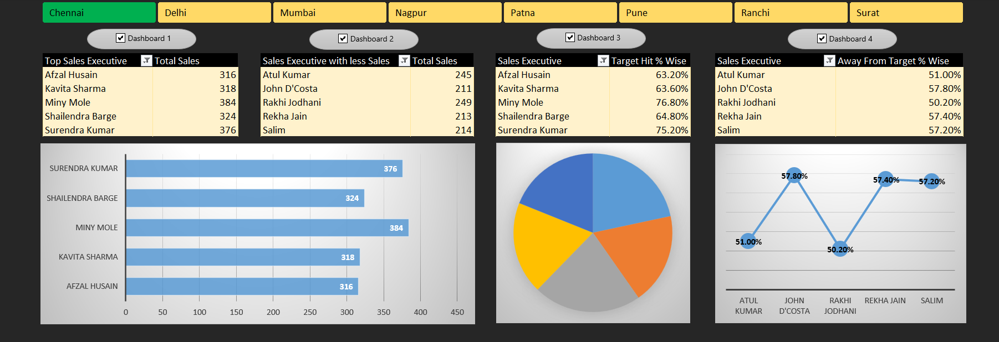
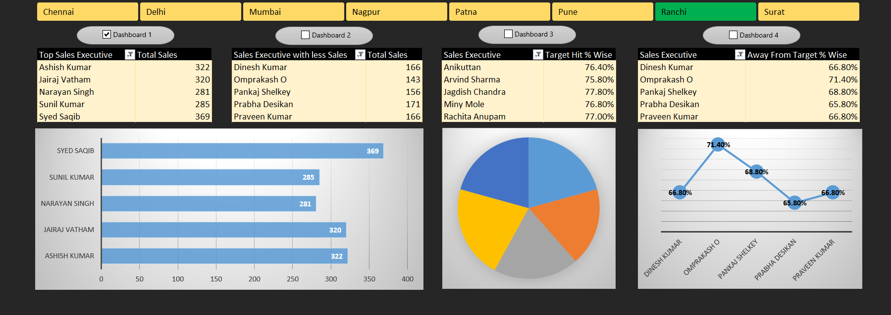

** Sales Dashboard **

-- Images

** Summary About Project **
--I worked on a sales data analysis project using Excel, where raw data included employee-wise sales details such as Emp Code, Sales Executive, Region, daily sales performance (Day1–Day5), Total Sales, Target, and achievement percentages. 
--Using queries, filters, and macros, I transformed the raw data into a structured format and developed an interactive dashboard. 
--The dashboard visualized key performance indicators (Total Sales, Target Achievement %, and Gap from Target) across regions and executives, providing management with actionable insights to monitor sales performance, track targets, and optimize strategies.

